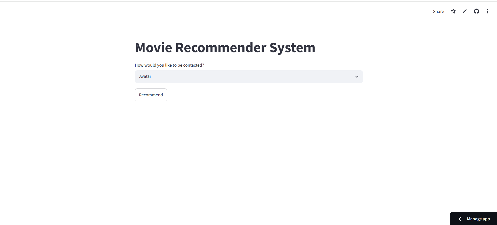
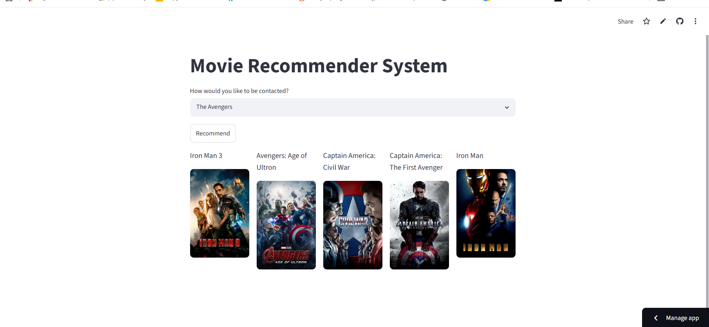

# 🎬 Content Based Movie Recommender System

A Content-Based Movie Recommendation System built using **Python**, **Streamlit**, and **Scikit-learn**. The system recommends movies similar to the one selected by the user based on movie metadata such as genres, keywords, cast, crew, and overview.

---

## 🚀 Demo

🔗 Live Demo: [Movie Recommender App] (https://content-based-movie-recommender-system-fk4snpwwmdvus2u3fjtcyh.streamlit.app/)

🔗 GitHub Repository: https://github.com/rishithvns/content-based-movie-recommender-system

---

## 📌 Features

- 🎥 Recommends 5 similar movies
- 🖼️ Displays movie posters using the TMDB API
- 🔍 Easy-to-use Streamlit interface
- ⚡ Fast recommendation using a precomputed similarity matrix
- 🎬 Uses content-based filtering instead of collaborative filtering

---

## 🛠️ Tech Stack

- Python
- Streamlit
- Pandas
- NumPy
- Scikit-learn
- NLTK
- Pickle
- Requests
- TMDB API

---

## 📂 Project Structure

```
content-based-movie-recommender-system/
│
├── app.py
├── movie_dict.pkl
├── similarity.pkl
├── requirements.txt
├── .gitignore
├── .gitattributes
├── README.md
```

---

## ⚙️ Installation

Clone the repository

```bash
git clone https://github.com/rishithvns/content-based-movie-recommender-system.git
```

Go to the project directory

```bash
cd content-based-movie-recommender-system
```

Create a virtual environment

```bash
python -m venv venv
```

Activate the virtual environment

Windows

```bash
venv\Scripts\activate
```

Install dependencies

```bash
pip install -r requirements.txt
```

Run the application

```bash
streamlit run app.py
```

---

## 📖 How It Works

1. Load the movie dataset.
2. Perform text preprocessing.
3. Combine important movie features.
4. Convert text into vectors using CountVectorizer.
5. Compute cosine similarity between all movies.
6. Save the similarity matrix.
7. Recommend the top 5 most similar movies.
8. Fetch movie posters from the TMDB API.

---

## 🧠 Machine Learning Concepts Used

- Natural Language Processing (NLP)
- Feature Engineering
- CountVectorizer
- Cosine Similarity
- Content-Based Recommendation

---

## 📷 Screenshots

### Home Page



### Recommendation Result



---

## 📈 Future Improvements

- Add movie trailers
- Improve UI design
- Search suggestions
- Genre-wise filtering
- Hybrid recommendation system
- User login and favorites

---

## 👨‍💻 Author

**Rishit V N S**

GitHub: https://github.com/rishithvns


---
